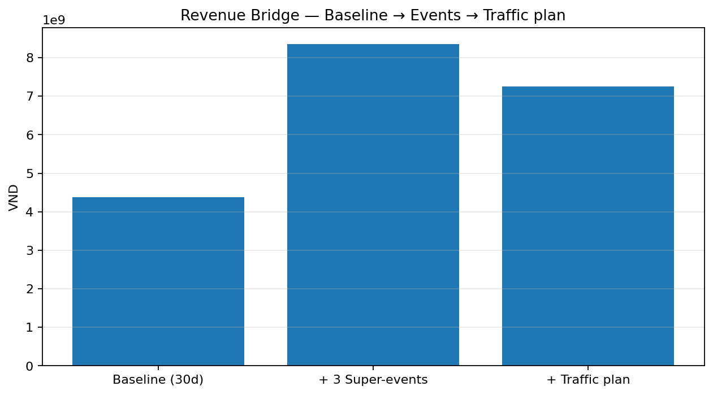
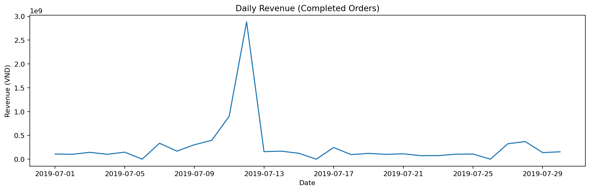
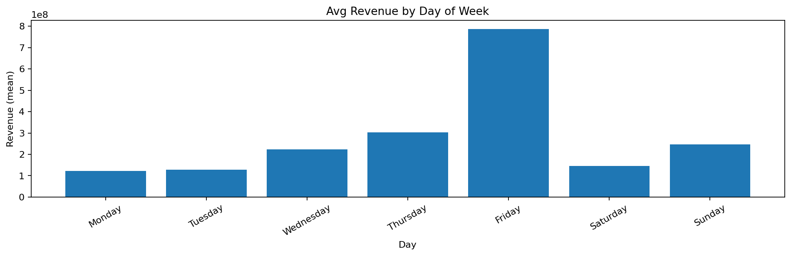
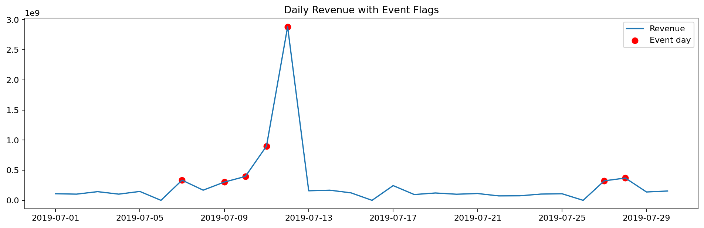
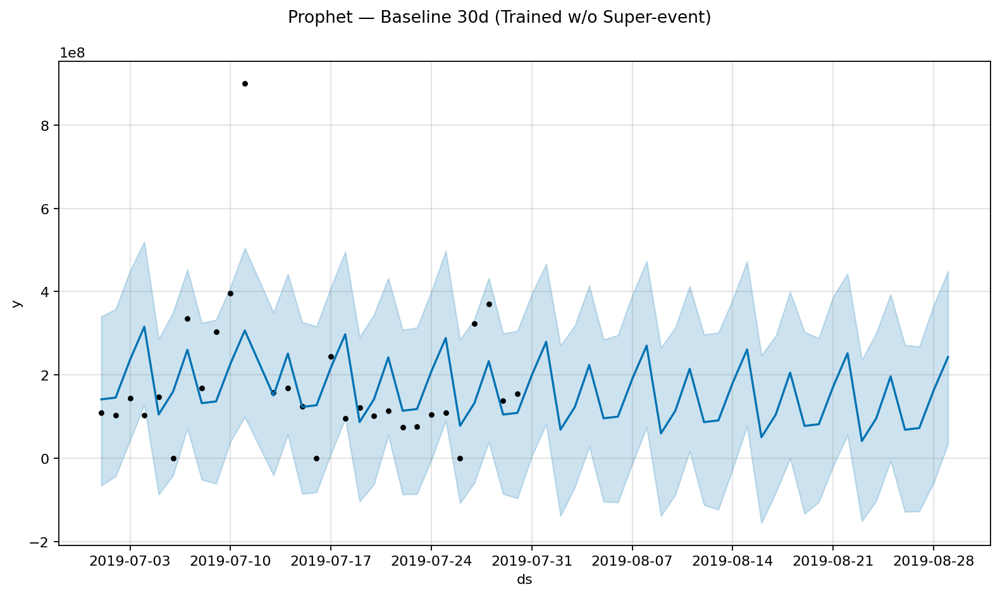

# Doubling to 20B VND — E-commerce Growth Plan  
**Plan B: 3 Super-Events + ROI-Gated Traffic Allocation (STRICT v3b)**

> **Objective:** Seller A achieved ~10B VND **gross** in July. **August KPI = 20B VND**.  
> **Deliverable:** A quantified, executable plan to hit 20B with clear pacing, budget/ROI guardrails, and risk controls.

> **Assets layout (adjust if different):**
> ```
> assets2/
>   images/   # charts & figures (PNG)
>   tables/   # CSVs for tables
>   docs/     # narrative / flow analysis
> ```

---

## Table of Contents
1. [Executive Summary](#executive-summary)  
2. [Data & Quality Assurance](#data--quality-assurance)  
3. [EDA: What the Data Says](#eda-what-the-data-says)  
4. [Baseline & Super-Event Modeling](#baseline--super-event-modeling)  
5. [Channel Diagnosis (SCALE / FIX / PAUSE)](#channel-diagnosis-scale--fix--pause)  
6. [Allocation Strategy — STRICT v3b (ROI-Gated)](#allocation-strategy--strict-v3b-roi-gated)  
7. [Revenue Bridge to 20B](#revenue-bridge-to-20b)  

---

## Executive Summary

**Revenue identity**

Revenue = Sessions × Conversion Rate (CVR) × Average Order Value (AOV)


**What we built**
- A **clean 30-day baseline** on **Completed** revenue, **excluding** the super-event outlier in July.  
- Quantified **uplift per super-event** and scenarioed the number of events needed.  
- Diagnosed channels (SCALE / FIX / PAUSE) using statistical tests; computed **RPS = CVR × AOV** and gated PAID scaling by **ROI** (RPS/CPC ≥ 1.1).  
- Constructed **traffic allocation (STRICT v3b)** with caps and **weekly→daily** pacing; included **risk & sensitivity**.

**Key numbers (from the sample run)**
- **Baseline (30d, Completed, excl. super-event)** ≈ **4.38B VND**  
- **Uplift per super-event** ≈ **2.79B VND** ⇒ **3 events ≈ +8.36B VND**  
- **Residual GAP pre-traffic** ≈ **7.26B VND**  
- **Traffic plan (STRICT v3b)** ≈ **7.26B VND** ⇒ **Total ≈ 20B VND (GAP = 0)**

**Bridge (slide-ready)**  


---

## Data & Quality Assurance

**Sources**
- **OMS Orders**: order lines (status, payment method, shipping, original/selling price).  
- **GA Traffic**: Source/Medium, Sessions, CVR, Revenue.

**Critical QA actions**
- **Removed GA `GRAND TOTAL`** (last row) to avoid double-counting.  
- OMS–GA reconciliation (illustrative for this sample):
  - GA **Gross Revenue (clean)** ≈ **10,006,473,136** VND  
  - OMS **Completed product revenue** ≈ **8,072,083,720** VND  
  - OMS **Cancelled product revenue** ≈ **1,993,771,450** VND  
  - **Shipping fee** (all / completed): ≈ **690,804,572 / 508,978,481** VND

Artifacts:
- Channel CVR diagnosis (SCALE/FIX/PAUSE): [`assets2/tables/channel_diagnosis_actions.csv`](assets2/tables/channel_diagnosis_actions.csv)

**Why it matters**  
Grounding the plan in **clean gross numbers** (and understanding Completed vs Cancelled vs Shipping) ensures the **uplift and ROI math** are reliable.

---

## EDA: What the Data Says

**Daily (Completed only)** — stable base with one sharp **super-event** spike.  


**By Day-of-Week (DOW)** — no material systematic DOW effect (non-significant Kruskal–Wallis p-values).  


**Super-event detection** — we **flag** the outlier (e.g., 12/07) and **exclude** it from baseline training.  


> **Takeaway:** Demand is mostly trend-driven; **super-events move the needle**. Use events to lift volume, then layer traffic allocation to close the residual GAP.

---

## Baseline & Super-Event Modeling

**Baseline**
- Model: **Prophet** (trend + weak weekly seasonality) on **Completed** revenue, **excluding** the super-event day.  
- Result (30d): **~4.38B VND**.



**Super-event uplift**
- Decomposed super-event into baseline vs event uplift.  
- **Per-event uplift**: **~2.79B VND** (used for "Plan B = 3 events").  
- Scenarioing (0→6 events) confirms **3 events** balance **feasibility, cost, and risk**.

**Why it matters**  
This separation prevents baseline over-estimation and aligns **inventory, bids, CRM**, and **site readiness** with event days.

---

## Channel Diagnosis (SCALE / FIX / PAUSE)

**Diagnostics**
- **RPS (Revenue per Session proxy)** = `CVR × AOV_proxy` (from GA).  
- **Z-test**: channel CVR vs rest (`proportions_ztest`), p < 0.05 ⇒ significant.  
- **Labeling**
  - **SCALE** — strong CVR (significant & ≥ median), strong RPS, low bounce  
  - **FIX** — material volume but sub-par RPS/CVR → fix LP/creative/offer/checkout  
  - **PAUSE** — long-tail or under-performing

See: [`assets2/tables/channel_diagnosis_actions.csv`](assets2/tables/channel_diagnosis_actions.csv)

**Why it matters**  
Turns a long GA list into an **actionable short-list** with **statistical backing**.

---

## Allocation Strategy — STRICT v3b (ROI-Gated)

**Principles**
1. **Priority**: `SCALE (1) → FIX (2)` → then **PAID ROI-pass (2.5)** if **RPS/CPC ≥ 1.1** (even if labeled PAUSE).  
2. **Caps**:  
   - **OWNED**: tight **≤ +50k incremental sessions (total add)**  
   - **PAID**: **≤ +3× additional sessions** (total ≤ 4× current)  
3. **FIX uplift pre-allocation**: apply **CVR +10%** & **AOV +3%** to FIX channels (quick-win experiments to be validated).

**Outputs**
- Master allocation — [`assets2/tables/strict_v3b_master_allocation.csv`](assets2/tables/strict_v3b_master_allocation.csv)  
- Summary by type — [`assets2/tables/strict_v3b_alloc_summary.csv`](assets2/tables/strict_v3b_alloc_summary.csv)  
- Budget estimate (CPC heuristics: Search≈1400, Social≈900, Video≈800 VND) — [`assets2/tables/budget_v3b.csv`](assets2/tables/budget_v3b.csv)

**Why it matters**  
The **ROI gate** avoids budget leakage while still **unlocking high-ROI PAID** (e.g., Google/YouTube) that may be mislabeled historically.

---

## Revenue Bridge to 20B

**30-day bridge**
- **Baseline**: ~**4.38B**  
- **+3 Super-events**: ~**+8.36B**  
- **+Traffic plan (STRICT v3b)**: ~**+7.26B**  
= **~20B (GAP = 0)**

  
Data: [`assets2/tables/revenue_bridge_v3b.csv`](assets2/tables/revenue_bridge_v3b.csv)

**Why it matters**  
This is the **board-level story**: how we get from 10B → 20B with quantified levers and controllable execution.

## FLOW ANALYSIS — Key Numbers (Plan B + STRICT v3b)

### A) DATA & RECONCILIATION
- **OMS date range:** 2019-07-01 → 2019-07-30  
- **OMS Placed product revenue:** 10.065.855.170 VND  
  - Completed product revenue: 8.072.083.720 VND  
  - Cancelled product revenue: 1.993.771.450 VND  
- **Shipping fee** (all): 690.804.572 VND · (completed): 508.978.481 VND  
- **GA (cleaned)** Revenue: 10.006.473.136 VND · Sessions: 1.259.452 · Transactions: 10.041  
- **Super-event day:** 2019-07-12 · Revenue: 2.881.886.000 VND · Orders: 12.229

---

### B) BRIDGE TO 20B
- **Baseline 30d:** 4.384.354.220 VND  
- **Uplift per super-event:** 2.785.814.825 VND → with **3 events:** 8.357.444.475 VND  
- **Residual GAP before traffic** (Baseline + Events vs 20B): 7.258.201.305 VND  
- **Traffic plan (STRICT v3b) add:** 7.258.225.247 VND  
- **PLAN TOTAL = Baseline + Events + Traffic = 20.000.023.942 VND**  
- **GAP after plan:** 0 VND

---

### C) WEEKLY PACING (traffic add, 30% / 0% / 30% / 40%)
- **W1:** 2.177.467.574 VND  
- **W2:** 0 VND  
- **W3:** 2.177.467.574 VND  
- **W4:** 2.903.290.099 VND

---

### D) ALLOCATION SUMMARY *(sessions_add | revenue_add)*
- **OWNED / SCALE:** channels = 2, sessions += 22.141, add = 227.972.615 VND  
- **PAID / PAUSE:** channels = 2, sessions += 710.886, add = 6.577.847.705 VND  
- **PAID / SCALE:** channels = 1, sessions += 21.432, add = 452.404.926 VND  

**Top channels (by revenue add):**
- *google / cpc* (PAID, **PAUSE**): sessions += **583.494**, add = **5.370.221.961** VND *(RPS ≈ 9.204 VND)*  
- *youtube.com / referral* (PAID, **PAUSE**): sessions += **127.392**, add = **1.207.625.744** VND *(RPS ≈ 9.480 VND)*  
- *l.facebook.com / referral* (PAID, **SCALE**): sessions += **21.432**, add = **452.404.926** VND *(RPS ≈ 21.109 VND)*  
- *(direct) / (none)* (OWNED, **SCALE**): sessions += **21.707**, add = **208.172.207** VND *(RPS ≈ 9.590 VND)*  
- *newsletter / email* (OWNED, **SCALE**): sessions += **434**, add = **19.800.408** VND *(RPS ≈ 45.623 VND)*

---

### E) DOWNSIDE CHECK
- If **PAID CVR −10%** ⇒ Traffic add **6.555.199.984 VND**, Plan total **19.296.998.679 VND**, Remaining gap **703.001.321 VND**.  
- **Mitigation:** reallocate to **high-ROI** (Google/YouTube), push **CRM**, and execute **AOV/CVR lifts** (bundles, LP speed/trust).

---

*Saved to:* [`assets2/docs/flow_analysis.md`](assets2/docs/flow_analysis.md)


